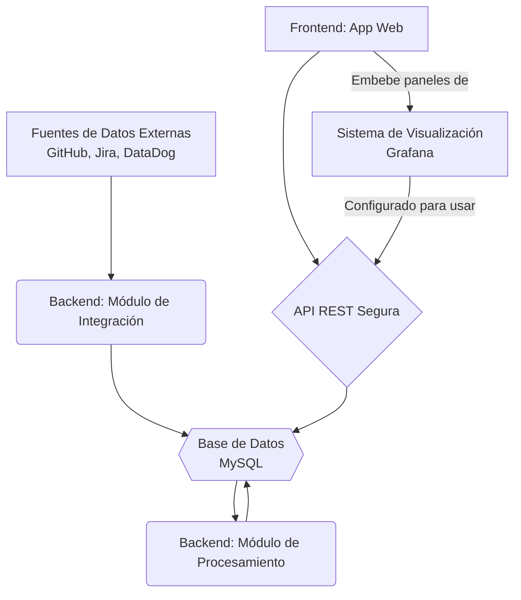
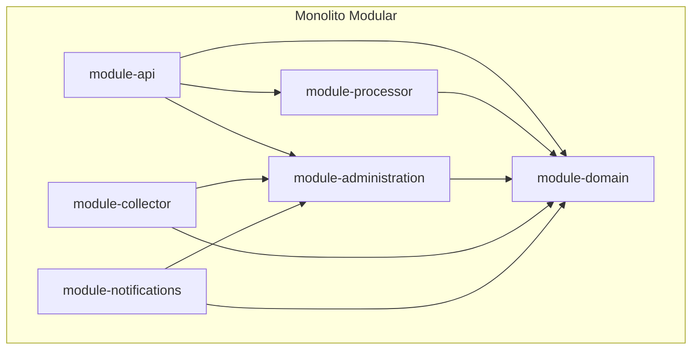
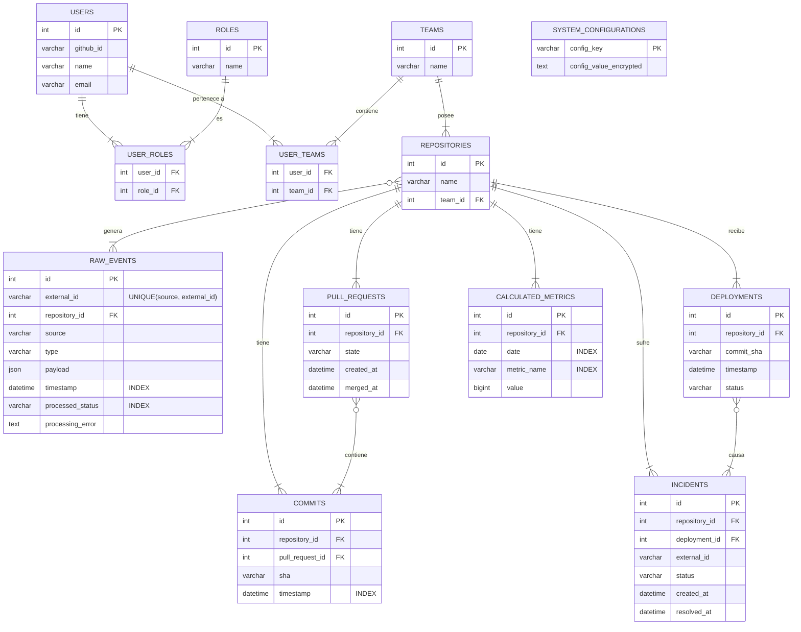
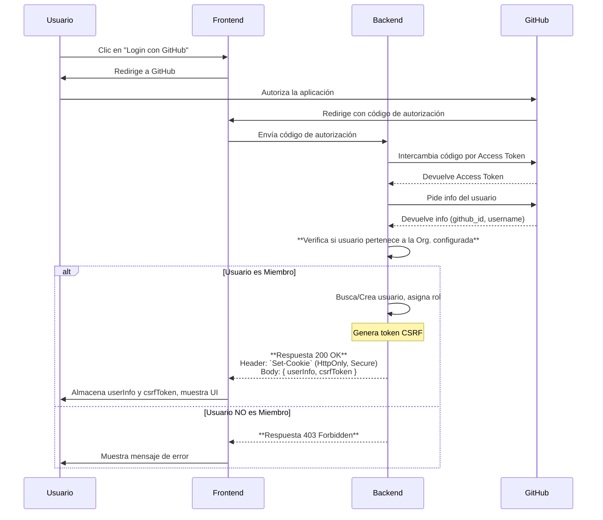
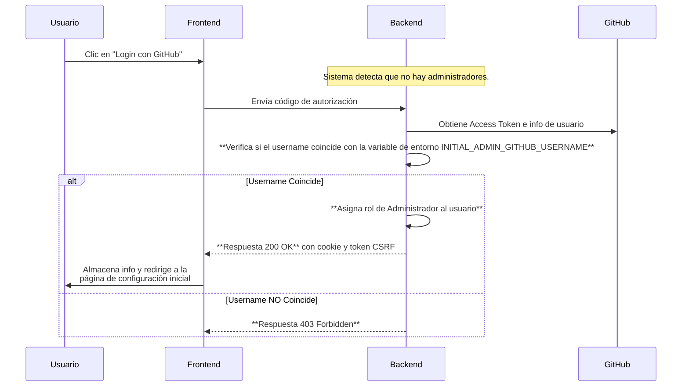
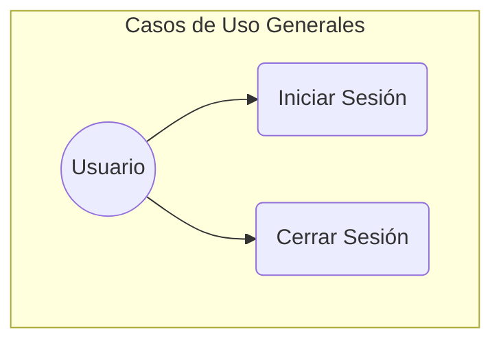
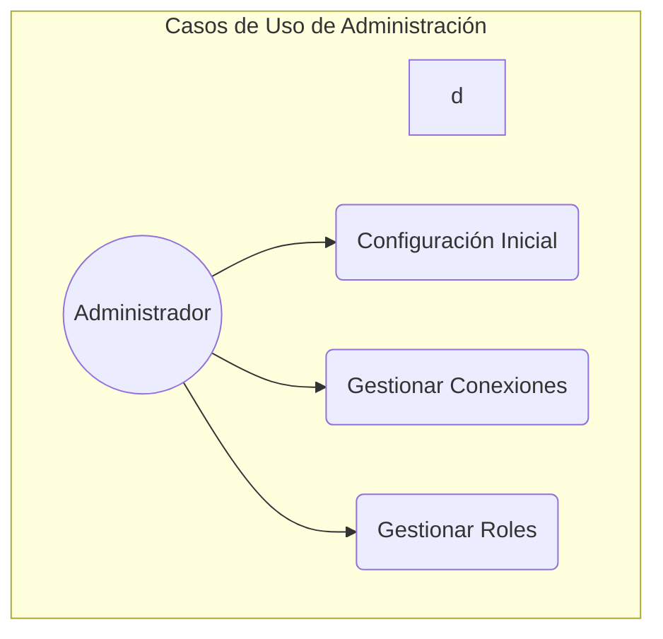
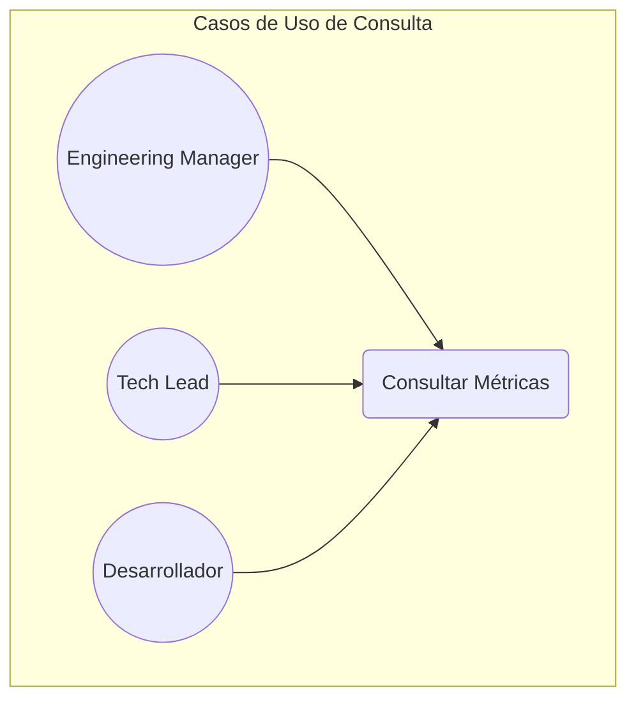
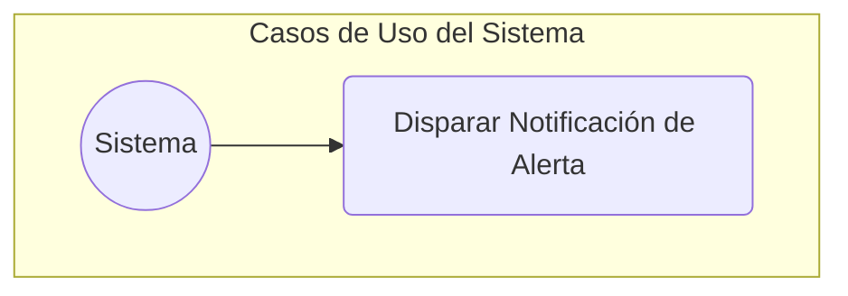
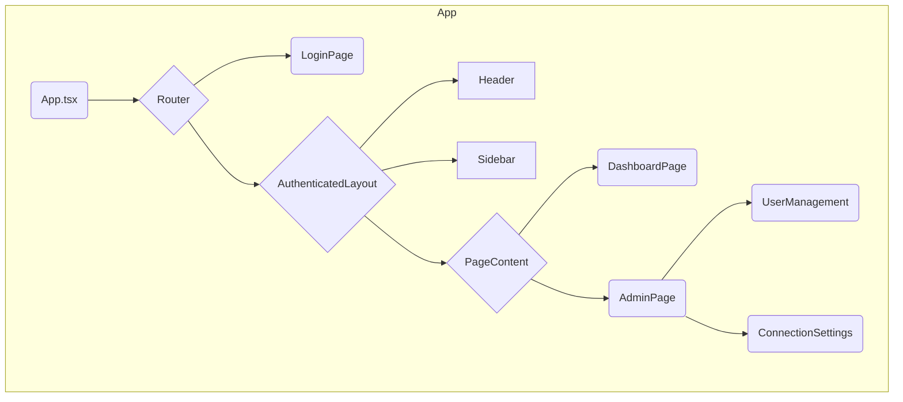

# Documento de Diseño de Software: Plataforma de Medición de Métricas DORA

**Versión:** 9.7 (Ampliación de Trabajo Futuro)
**Autor:** Edson Abraham Chavez Montaño
**Fecha:** 14 de agosto de 2025

---

## 1. Introducción

### 1.1. Propósito
El presente documento describe la arquitectura, los componentes y el diseño general de la solución de software propuesta en la tesis "Propuesta de implementación de una solución para la medición de métricas de desempeño de entrega de software para equipos de desarrollo". Este documento servirá como guía técnica para la implementación del proyecto.

### 1.2. Resumen del Proyecto
El proyecto consiste en el desarrollo de una plataforma para la medición continua y automatizada del rendimiento de entrega de software, centrándose en las cuatro métricas clave de DORA (Frecuencia de Despliegue, Tiempo de Espera para Cambios, Tasa de Fallo de Cambio y Tiempo Medio de Recuperación). La solución extraerá datos de herramientas existentes en el ciclo de vida de desarrollo, los procesará y los presentará en dashboards visuales para facilitar la toma de decisiones basada en datos.

---

## 2. Objetivos y Resultados Esperados

### 2.1. Objetivo General
Implementar una solución para la medición continua del rendimiento de entrega de software en equipos de desarrollo, automatizando la recolección de datos de herramientas existentes, con el fin de proporcionar una base para la mejora continua y la predicción de resultados organizacionales.

### 2.2. Objetivos Específicos y Resultados Esperados

* **O1: Automatizar la recolección y consolidación de datos del ciclo de vida.**
    * **Resultado Esperado 1.1:** Un Módulo de Integración de Datos (`module-collector`) capaz de extraer y consolidar automáticamente los eventos clave del ciclo de vida del software desde las APIs de GitHub, Jira y DataDog.
    * **Resultado Esperado 1.2:** Una base de datos centralizada y estructurada que almacena de forma persistente tanto los datos crudos recolectados (`Raw_Events`) como las entidades de dominio procesadas (ej. `Commits`, `Deployments`).

* **O2: Calcular de manera continua métricas de desempeño de entrega.**
    * **Resultado Esperado 2.1:** Un Módulo de Procesamiento (`module-processor`) que calcula de forma continua y idempotente las cuatro métricas DORA a partir de las entidades de dominio estructuradas.
    * **Resultado Esperado 2.2:** La capacidad del sistema para agregar y almacenar las métricas calculadas (`Calculated_Metrics`) a nivel de repositorio individual y por equipo, permitiendo un análisis detallado del rendimiento.

* **O3: Implementar medios de visualización y reporte de métricas como apoyo a la toma de decisiones.**
    * **Resultado Esperado 3.1:** Un dashboard interactivo (utilizando Grafana embebido) que visualice las métricas DORA y sus tendencias a lo largo del tiempo, con vistas adaptadas a cada rol de usuario.
    * **Resultado Esperado 3.2:** Un Módulo de Notificaciones (`module-notifications`) capaz de enviar alertas por correo electrónico cuando se detecten desviaciones significativas en el rendimiento.

---

## 3. Alcance y Limitaciones

### 3.1. Dentro del Alcance (Visión Completa del Sistema)
- Desarrollo de un **Módulo de Integración** para la recolección de datos de GitHub, Jira y DataDog.
- Desarrollo de un **Módulo de Procesamiento** para el cálculo continuo de las 4 métricas DORA.
- Implementación de una **interfaz web** con un **Módulo de Visualización**.
- Implementación de un sistema de **alertas por correo electrónico**.
- Desarrollo de un **Módulo de Gestión de Roles**.
- Desarrollo de un **Módulo de Configuración del Sistema**.

### 3.2. Fuera del Alcance General
- El desarrollo de una aplicación móvil.
- La integración con herramientas distintas a las mencionadas en el alcance.

### 3.3. Alcance de la Implementación (MVP para la Tesis)
Para asegurar la entrega de un producto funcional en el tiempo estipulado, la implementación se centrará en un Producto Mínimo Viable (MVP) con el siguiente alcance:

* **Funcionalidades Incluidas en el MVP:**
    * **Integraciones:** Se implementará la integración completa con las 3 fuentes de datos: **GitHub, Jira y DataDog**.
    * **Cálculo de Métricas:** Se implementará el cálculo de las **4 métricas DORA**.
    * **Seguridad y Roles:** Se implementará el flujo de login completo con **GitHub**, la restricción por organización y la **gestión de roles** en la interfaz de usuario.
    * **Visualización:** Se implementará el dashboard con **vistas adaptativas** según el rol del usuario.
    * **Alertas:** Se implementará el sistema de **alertas por correo electrónico**.

* **Funcionalidades Simplificadas o Excluidas del MVP (Trabajo Futuro):**
    * **Gestión de Conexiones en la UI:** La configuración de las conexiones (claves de API, nombre de la organización) se manejará **exclusivamente a través de variables de entorno** en el despliegue. Se pospone la creación de la interfaz de usuario para esta gestión.
    * **Sincronización Manual en la UI:** El caso de uso para disparar una sincronización manual desde la interfaz de usuario se pospondrá. La sincronización operará únicamente de forma automática y periódica.
    * **Módulo de Observabilidad:** Una futura versión podría incluir un módulo dedicado a monitorear la salud del propio sistema de métricas (ej. estado de los jobs, latencia de la API, etc.).
    * **Módulo de Gobernanza de Datos:** Para gestionar el ciclo de vida de los datos, incluyendo políticas de retención y anonimización para cumplir con normativas de privacidad.

---

## 4. Personas y Roles de Usuario (RBAC)
El sistema implementará un Control de Acceso Basado en Roles (RBAC) estricto.

- **Administrador:**
    - **Acceso:** Tiene acceso a **todas las funcionalidades del sistema**, incluyendo la gestión de roles, la configuración del sistema y la visualización de todos los dashboards de métricas.
    - **Función:** Configurar, mantener y verificar el correcto funcionamiento de la aplicación, además de gestionar los roles de otros usuarios.
- **Engineering Manager:**
    - **Acceso:** Tiene una visión global de todas las métricas, de todos los equipos y todos los repositorios de la organización.
    - **Función:** Analizar el rendimiento organizacional, comparar equipos e identificar tendencias estratégicas.
- **Tech Lead:**
    - **Acceso:** Tiene acceso únicamente a las métricas de los repositorios y desarrolladores que pertenecen a su equipo.
    - **Función:** Monitorear la salud y el rendimiento de su equipo.
- **Desarrollador:**
    - **Acceso:** Visualiza las métricas relacionadas con su trabajo directo. Rol por defecto.
    - **Función:** Obtener feedback rápido sobre el impacto de su trabajo.

---

## 5. Arquitectura de Alto Nivel
La solución seguirá una arquitectura modular, con un claro desacoplamiento entre la recolección de datos, el procesamiento y la presentación. La comunicación entre el frontend y el backend se realizará exclusivamente a través de una API REST segura.

### 5.1. Estilo Arquitectónico del Backend
Para el backend, se ha elegido un enfoque de **Monolito Modular**. Esta decisión equilibra la simplicidad de desarrollo y despliegue de una aplicación monolítica con la disciplina de separación de dominios y bajo acoplamiento de una arquitectura de microservicios. Para implementar y verificar esta arquitectura, se utilizará el proyecto **Spring Modulith**.

- **Ventajas para este proyecto:**
    - **Un único repositorio y pipeline de CI/CD:** Reduce la complejidad operativa.
    - **Comunicación directa y performante entre módulos:** Evita la latencia de red y la complejidad de la comunicación entre servicios.
    - **Mantenimiento de la separación de dominios:** El código se organiza en módulos lógicos que evitan el acoplamiento indebido.
    - **Verificación Arquitectónica:** Spring Modulith permitirá crear pruebas que verifiquen automáticamente que las dependencias entre módulos son correctas, previniendo el deterioro arquitectónico.
    - **Preparado para el futuro:** Facilita la extracción de un módulo a un microservicio si fuera necesario en el futuro.

La comunicación entre los procesos de recolección y procesamiento de datos será **asíncrona y mediada por la base de datos**.
***Nota de Diseño (Comunicación Asíncrona):*** *Este enfoque es una simplificación pragmática para el alcance de este proyecto. Una evolución natural para un sistema a mayor escala sería incorporar un message broker dedicado (como RabbitMQ o Kafka) para un desacoplamiento aún más robusto.*

***Nota de Diseño (API REST vs. GraphQL):*** *Para la comunicación entre el frontend y el backend, se ha elegido una API REST por su simplicidad de implementación y su robusto ecosistema en Spring Boot. Si bien GraphQL podría ofrecer una mayor eficiencia en la obtención de datos para dashboards complejos, la combinación de una API REST bien diseñada con TanStack Query en el frontend mitiga los problemas de "over-fetching" y "under-fetching" de manera efectiva para el alcance de este proyecto. GraphQL se considera una posible evolución futura si los requisitos de consulta de datos se vuelven significativamente más complejos.*

### Diagrama de Flujo de Componentes

---

## 6. Detalle de Componentes

### 6.1. Backend (Java / Spring Boot)
El backend se estructurará como un **Monolito Modular** utilizando **Spring Modulith** para definir y verificar los límites de cada módulo. El proyecto de Spring Boot se organizará en los siguientes módulos lógicos (paquetes de Java), cada uno anotado como un `@ApplicationModule`.

- **`module-domain`:**
    - **Responsabilidad:** Actúa como el núcleo de la aplicación. Define la **Única Fuente de Verdad** para el modelo de datos.
    - **Componentes:** Clases de Entidad JPA (`@Entity`) e interfaces de Repositorio de Spring Data JPA (`JpaRepository`). **No contiene DTOs.**
- **`module-collector`:**
    - **Responsabilidad:** Conectarse a las APIs externas para recolectar eventos de forma **idempotente**. Su función es guardar cada evento externo una única vez en la tabla `Raw_Events`. Utiliza DTOs específicos para cada fuente externa, implementando el patrón **Anticorruption Layer (ACL)**.
    - **Componentes:** Clases de servicio para cada integración, DTOs específicos para las APIs externas, lógica de scheduling con manejo de errores de duplicados.
- **`module-processor`:**
    - **Responsabilidad:** Orquestar el pipeline de datos interno de forma resiliente.
        1.  Lee un lote de `Raw_Events` en estado `PENDING`.
        2.  Parsea los payloads y los transforma en entidades de dominio estructuradas.
        3.  Si el procesamiento de un evento falla, lo marca como `FAILED`, registra el error, y continúa con el siguiente.
        4.  Si es exitoso, calcula las métricas DORA y guarda los resultados.
        5.  Marca los `Raw_Events` exitosos como `COMPLETED`.
        6.  **Publica un evento de dominio** (ej. `MetricThresholdExceededEvent`) si se detectan cambios significativos en las métricas.
    - **Componentes:** Calculadoras de métricas, lógica de agregación, lógica de scheduling transaccional, manejo de errores.
- **`module-notifications`:**
    - **Responsabilidad:** **Escuchar eventos de dominio** y gestionar el envío de notificaciones salientes en respuesta a ellos.
    - **Componentes:** Oyentes de eventos (`@EventListener`), Servicio de Email, plantillas de correo.
- **`module-administration`:**
    - **Responsabilidad:** Gestionar la configuración del sistema (incluyendo el cifrado de secretos) y los roles de usuario.
    - **Componentes:** Lógica de negocio para la gestión de roles y configuración, servicio de criptografía.
- **`module-api`:**
    - **Responsabilidad:** Exponer los datos y la funcionalidad a través de una API REST pública y segura. Actúa como la **fachada y orquestador** para todas las peticiones externas.
    - **Componentes:** Controladores REST que delegan la lógica a los servicios de los módulos `-processor` y `-administration`. DTOs que definen el contrato de la API. Configuración de Spring Security para OAuth y RBAC.

#### Diagrama de Módulos del Backend (Dependencias de Compilación)

***Nota de Diseño:*** *Las dependencias entre módulos serán verificadas a través de pruebas de Spring Modulith. La comunicación entre `module-processor` y `module-notifications` se realiza de forma desacoplada a través de eventos de dominio, eliminando una dependencia de compilación directa. Las dependencias restantes son intencionales para permitir la orquestación y el acceso a la configuración.*

### 6.2. Base de Datos (MySQL)
Contendrá, como mínimo, las siguientes entidades. El modelo se expande para incluir entidades estructuradas que facilitan el cálculo de métricas.

- `Users` (id, github_id, name, email)
- `Roles` (id, name) - Ej: 'ADMIN', 'ENGINEERING_MANAGER', 'TECH_LEAD', 'DEVELOPER'
- `User_Roles` (user_id, role_id)
- `Teams` (id, name)
- `User_Teams` (user_id, team_id) - Tabla de unión para la relación N-M.
- `Repositories` (id, name, team_id)
- `Raw_Events` (id, **external_id**, repository_id (nullable), source, type, payload, timestamp, processed_status, processing_error)
- `Pull_Requests` (id, repository_id, github_pr_id, state, created_at, merged_at)
- `Commits` (id, repository_id, pull_request_id (nullable), sha, author, timestamp)
- `Deployments` (id, repository_id, commit_sha, timestamp, status)
- `Incidents` (id, repository_id, deployment_id (nullable), external_id, status, created_at, resolved_at)
- `Calculated_Metrics` (id, repository_id, date, metric_name, value bigint) - *Nota: Las métricas basadas en tiempo se almacenarán en segundos.*
- `System_Configurations` (config_key, **config_value_encrypted**)

#### 6.2.1. Estrategia de Indexación
Para garantizar un rendimiento óptimo de las consultas, se definirán los siguientes índices clave. Otros índices sobre claves foráneas serán creados automáticamente por el motor de la base de datos.

* **`Raw_Events`**:
    * Índice en `(processed_status, timestamp)`: Esencial para que el `module-processor` pueda buscar eficientemente los eventos pendientes de procesar en orden cronológico.
* **`Commits`**:
    * Índice en `(repository_id, timestamp)`: Optimiza la búsqueda de commits para un repositorio específico dentro de un rango de fechas, una operación común para calcular el *Lead Time*.
* **`Calculated_Metrics`**:
    * Índice compuesto en `(repository_id, metric_name, date)`: Acelera drásticamente las consultas de la API y los dashboards, que típicamente filtrarán por una métrica específica para un repositorio en un período de tiempo.

#### 6.2.2. Garantías de Idempotencia
Para asegurar la integridad de los datos, el pipeline será idempotente en sus dos etapas críticas:

* **Idempotencia en la Recolección:** Para evitar registrar el mismo evento externo varias veces, la tabla `Raw_Events` incluirá una columna `external_id` (el ID del evento en su sistema de origen) y una restricción de unicidad (`UNIQUE`) sobre la combinación de `(source, external_id)`. El `module-collector` manejará los errores de violación de esta restricción, ignorando los eventos duplicados.
* **Idempotencia en el Procesamiento:** Para evitar procesar el mismo evento crudo varias veces, el `module-processor` utilizará la columna `processed_status`. Solo seleccionará eventos en estado `PENDING` y los actualizará a `COMPLETED` o `FAILED` dentro de una transacción, asegurando que cada evento se procese una sola vez.

#### Diagrama de Entidad-Relación (Completo)

### 6.3. Frontend (Aplicación Web con Grafana)
Será una Single-Page Application (SPA).
- Se encargará de la experiencia de usuario general, incluyendo la autenticación y la navegación.
- Implementará las interfaces para los **Módulos de Gestión de Roles y Configuración del Sistema**.
- **Embeberá paneles de Grafana** para la visualización de datos. La instancia de Grafana estará configurada para usar la API REST del backend como su fuente de datos principal.

---

## 7. Modelo de Seguridad

- **Autenticación y Gestión de Sesión:** Se utilizará el protocolo **OAuth 2.0 con GitHub**. La sesión del usuario se gestionará a través de una **cookie segura (`HttpOnly`, `Secure`)** establecida por el backend. Esto mitiga el riesgo de robo de tokens por ataques XSS, ya que el token de sesión no es accesible desde el JavaScript del navegador.
- **Restricción de Acceso:** El acceso a la aplicación estará restringido únicamente a los miembros de una organización de GitHub específica, configurada en el sistema.
- **Proceso de Arranque (Bootstrap) del Primer Administrador:** Para evitar una vulnerabilidad en el primer inicio de sesión, el proceso será más robusto.
    - Se requerirá una variable de entorno en el momento del despliegue (ej. `INITIAL_ADMIN_GITHUB_USERNAME=nombre-de-usuario`).
    - En el primer arranque, si la base de datos no contiene administradores, el sistema buscará esta variable. Solo el usuario de GitHub especificado en ella podrá convertirse en el primer administrador al iniciar sesión.
- **Autorización (RBAC):** Una vez que un usuario autorizado ha iniciado sesión, el sistema aplicará el control de acceso basado en roles para determinar qué datos y funcionalidades puede ver.
- **Protección contra CSRF:** Dado que se usan cookies de sesión, el backend implementará protección contra Cross-Site Request Forgery. Esto se logrará mediante un token anti-CSRF que el backend genera y el frontend debe incluir en las cabeceras de todas las peticiones que modifican el estado (POST, PUT, DELETE).
- **Gestión de Secretos (Secrets Management):**
    - Los valores sensibles (claves de API, tokens) almacenados en la tabla `System_Configurations` serán **cifrados en reposo** (encryption at rest). La implementación se realizará utilizando la librería **Jasypt (Java Simplified Encryption)**.
    - La clave de cifrado maestra se proporcionará a la aplicación a través de una **variable de entorno** (ej. `JASYPT_ENCRYPTOR_PASSWORD`).
- **Estrategia de Configuración:** Se utilizarán dos mecanismos distintos para la configuración:
    - **Variables de Entorno:** Se usarán para configuraciones de arranque e infraestructura que la aplicación necesita para iniciarse. Son estáticas y no se modifican en tiempo de ejecución. Ejemplos: `DATABASE_URL`, `JASYPT_ENCRYPTOR_PASSWORD`, `INITIAL_ADMIN_GITHUB_USERNAME`.
    - **Tabla `System_Configurations`:** Se usará para configuraciones de negocio y de la aplicación que pueden ser modificadas por un Administrador a través de la UI sin necesidad de reiniciar el sistema. Ejemplos: `GITHUB_ORGANIZATION_NAME`, `JIRA_PROJECT_KEY`, umbrales para alertas de métricas.
- **Seguridad de la API para Grafana:** El token de sesión del usuario (en la cookie) será reenviado automáticamente por el navegador en las peticiones que Grafana haga a la API, asegurando que las consultas de datos respeten los permisos del usuario.

### Diagrama de Flujo de Autorización (Normal)

### Diagrama de Flujo de Autorización (Primer Administrador - Día Cero)

---

## 8. Stack Tecnológico

| Componente | Herramienta/Tecnología | Justificación |
| :--- | :--- | :--- |
| **Backend** | Java 21, Spring Boot 3.5.4 | Ecosistema robusto, maduro y de alto rendimiento. Aprovecha características modernas como Hilos Virtuales. |
| **Backend (Modularidad)** | **Spring Modulith** | Para verificar y documentar la arquitectura modular, previniendo el deterioro arquitectónico. |
| **Base de Datos** | MySQL 8+ | Sistema de BD relacional de código abierto, confiable y ampliamente utilizado. |
| **Visualización** | Grafana | Estándar de la industria para dashboards de monitoreo y métricas. |
| **Frontend** | React (con Vite) | Framework moderno, declarativo y basado en componentes, ideal para SPAs complejas. Vite ofrece una experiencia de desarrollo ultrarrápida. |
| **Frontend (Estado del Servidor)** | **TanStack Query** | Estándar de facto para gestionar la comunicación con APIs, el cacheo de datos y los estados de carga/error, simplificando el código y mejorando la experiencia de usuario. |
| **Contenerización** | Docker | Para empaquetar la aplicación y sus dependencias, garantizando consistencia. |
| **CI/CD** | GitHub Actions | Para automatizar la integración, pruebas y despliegue continuo. |
| **IaC** | Terraform | Para definir y provisionar la infraestructura de nube de forma declarativa. |

---

## 9. Casos de Uso Principales
A continuación se describen los casos de uso de alto nivel, agrupados por el actor principal que los inicia.

### 9.1. Casos de Uso Generales (Cualquier Usuario Autenticado)

| Caso de Uso | Actor Principal | Resumen |
| :--- | :--- | :--- |
| **Iniciar Sesión** | Usuario (No autenticado) | El usuario inicia el flujo de autenticación a través de GitHub para acceder a la aplicación. El acceso solo se concede si pertenece a la organización configurada. |
| **Cerrar Sesión** | Usuario (Autenticado) | El usuario finaliza su sesión activa en la aplicación. |

### 9.2. Casos de Uso de Administración (Rol: Administrador)

| Caso de Uso | Actor Principal | Resumen |
| :--- | :--- | :--- |
| **Configuración Inicial** | Primer Usuario | El primer usuario que inicia sesión en un sistema no configurado se convierte en Administrador y es guiado para realizar la configuración inicial. |
| **Gestionar Conexiones** | Administrador | El administrador puede añadir, editar o eliminar las configuraciones de conexión a las APIs externas (GitHub, Jira, DataDog). |
| **Gestionar Roles** | Administrador | El administrador puede asignar, ver y revocar los roles de los usuarios de la aplicación. |

### 9.3. Casos de Uso de Consulta (Roles: Engineering Manager, Tech Lead, Desarrollador)

| Caso de Uso | Actor Principal | Resumen |
| :--- | :--- | :--- |
| **Consultar Métricas** | Engineering Manager, Tech Lead, Desarrollador | El usuario visualiza los dashboards de métricas DORA. La vista y el alcance de los datos presentados se adaptan automáticamente según el rol del usuario. |

### 9.4. Casos de Uso del Sistema (Procesos Automatizados)

| Caso de Uso | Actor Principal | Resumen |
| :--- | :--- | :--- |
| **Disparar Notificación de Alerta** | Sistema | El sistema envía una notificación por correo electrónico cuando detecta una desviación significativa en una métrica calculada. |

---

## 10. Detalle de Casos de Uso (Historias de Usuario y Criterios de Aceptación)

Esta sección desglosa los casos de uso en historias de usuario accionables y sus correspondientes Criterios de Aceptación (AC).

### 10.1. Historias de Usuario Generales

* **HU-1: Iniciar Sesión**
    - **Como** un usuario no autenticado, **quiero** poder iniciar sesión con mi cuenta de GitHub, **para** acceder a la aplicación de forma segura.
    - **AC 1.1:** Dado que no estoy logueado, cuando hago clic en "Iniciar Sesión con GitHub", entonces soy redirigido a la página de autorización de GitHub.
    - **AC 1.2:** Dado que he autorizado la aplicación en GitHub, cuando soy redirigido de vuelta, entonces debo ver el dashboard principal y mi sesión debe estar activa.
    - **AC 1.3:** Dado que no soy miembro de la organización configurada, cuando intento iniciar sesión, entonces veo un mensaje de error de "Acceso Denegado".

* **HU-2: Cerrar Sesión**
    - **Como** un usuario autenticado, **quiero** poder cerrar mi sesión, **para** proteger mi cuenta cuando termine de usar la aplicación.
    - **AC 2.1:** Dado que estoy logueado, cuando hago clic en "Cerrar Sesión", entonces mi sesión se invalida y soy redirigido a la página de inicio de sesión.

### 10.2. Historias de Usuario de Administración

* **HU-3: Configuración Inicial**
    - **Como** el primer usuario de la aplicación, **quiero** ser asignado automáticamente como Administrador, **para** poder realizar la configuración inicial del sistema.
    - **AC 3.1:** Dado que la aplicación no tiene una organización configurada ni administradores, cuando inicio sesión por primera vez, entonces mi usuario es creado con el rol de "Administrador".
    - **AC 3.2:** Dado que soy el primer administrador, después de iniciar sesión, entonces soy redirigido a la página de "Configuración del Sistema".

* **HU-4: Gestionar Conexiones**
    - **Como** Administrador, **quiero** poder introducir y guardar las credenciales (claves de API) para GitHub, Jira y DataDog, **para** que el sistema pueda recolectar datos.
    - **AC 4.1:** Dado que estoy en la página de configuración, cuando introduzco una clave de API válida y la guardo, entonces veo un mensaje de confirmación y la clave se almacena de forma cifrada.
    - **AC 4.2:** Dado que estoy en la página de configuración, cuando introduzco el nombre de la organización de GitHub y guardo, entonces el sistema valida que la aplicación tiene acceso a esa organización antes de guardar.

* **HU-5: Gestionar Roles**
    - **Como** Administrador, **quiero** poder ver una lista de todos los usuarios pertenecientes a la organización y asignarles roles, **para** controlar el acceso a la aplicación.
    - **AC 5.1:** Dado que estoy en la página de gestión de usuarios, cuando la página carga, entonces veo una tabla con todos los miembros de la organización de GitHub sincronizados.
    - **AC 5.2:** Dado que estoy viendo la lista de usuarios, entonces cada usuario que no tiene un rol explícitamente asignado se muestra con el rol por defecto "Desarrollador".
    - **AC 5.3:** Dado que estoy en la página de gestión de usuarios, cuando selecciono un usuario y le asigno el rol "Tech Lead", entonces el cambio se persiste y se refleja en la lista.
    - **AC 5.4:** Dado que estoy en la página de gestión de usuarios, cuando selecciono un usuario y le asigno el rol "Engineering Manager", entonces el cambio se persiste y se refleja en la lista.
    - **AC 5.5:** Dado que estoy en la página de gestión de usuarios, cuando selecciono un usuario y le asigno el rol "Administrador", entonces el cambio se persiste y se refleja en la lista.

### 10.3. Historias de Usuario de Consulta

* **HU-7: Dashboard de Engineering Manager**
    - **Como** Engineering Manager, **quiero** ver un dashboard con las métricas DORA agregadas a nivel de toda la organización, **para** entender el rendimiento general de la ingeniería.
    - **AC 7.1:** Dado que he iniciado sesión como Engineering Manager, cuando accedo al dashboard, entonces los gráficos muestran por defecto los datos de todos los equipos.
    - **AC 7.2:** Dado que estoy viendo el dashboard, cuando uso el filtro de equipo y selecciono "Equipo Alfa", entonces todos los gráficos se actualizan para mostrar solo los datos del "Equipo Alfa".

* **HU-8: Dashboard de Tech Lead**
    - **Como** Tech Lead, **quiero** ver un dashboard con las métricas DORA específicas de mi equipo y sus repositorios, **para** monitorear la salud y la eficiencia de mi equipo.
    - **AC 8.1:** Dado que he iniciado sesión como Tech Lead del "Equipo Beta", cuando accedo al dashboard, entonces solo veo los datos del "Equipo Beta".
    - **AC 8.2:** Dado que soy Tech Lead, cuando veo el dashboard, entonces no tengo la opción de filtrar por otros equipos.

* **HU-9: Dashboard de Desarrollador**
    - **Como** Desarrollador, **quiero** ver un dashboard con las métricas DORA de los repositorios en los que contribuyo, **para** entender el impacto de mi trabajo en el ciclo de entrega.
    - **AC 9.1:** Dado que he iniciado sesión como Desarrollador, cuando accedo al dashboard, entonces los gráficos muestran por defecto los datos de todos los repositorios en los que he hecho commits.

### 10.4. Historias de Usuario del Sistema

* **HU-10: Enviar Notificación de Alerta de Métrica**
    * **Como** el sistema, **quiero** enviar una notificación por correo electrónico, **para** alertar a los usuarios relevantes sobre cambios significativos en el rendimiento.
    * **AC 10.1:** Dado que el `module-processor` ha calculado una nueva métrica, cuando el valor de esta métrica excede un umbral predefinido, entonces se dispara un evento de notificación.
    * **AC 10.2:** Dado que se ha disparado un evento de notificación, cuando el `module-notifications` lo recibe, entonces se envía un correo electrónico al Tech Lead o Engineering Manager responsable del repositorio o equipo afectado.

---

## 11. Diseño del Frontend

Esta sección detalla la arquitectura y los componentes de la aplicación de frontend.

### 11.1. Framework y Herramientas
- **Framework:** **React (con Vite)**. Se elige React por su robusto ecosistema, su modelo de componentes declarativo y el amplio soporte de la comunidad. Vite se utilizará como herramienta de build por su experiencia de desarrollo extremadamente rápida (Hot Module Replacement).
- **Lenguaje:** **TypeScript**. Para añadir seguridad de tipos y mejorar la mantenibilidad del código.
- **Estilos:** **Tailwind CSS**. Un framework CSS "utility-first" que permite construir diseños complejos rápidamente sin salir del HTML, promoviendo la consistencia visual.
- **Gestión de Estado:**
    - **Estado Global de UI:** **React Context API con Hooks**. Para gestionar el estado de la sesión del usuario (información del usuario, rol), que es global y cambia con poca frecuencia.
    - **Estado del Servidor:** **TanStack Query (React Query)**. Para gestionar todo el ciclo de vida de las peticiones a la API: fetching, caching, sincronización y actualización de datos del servidor.

### 11.2. Estructura de Componentes Principales
La aplicación se organizará en una jerarquía de componentes reutilizables.

- **`App.tsx`**: El componente raíz que inicializa la aplicación y el proveedor de TanStack Query.
- **`Router`**: Gestiona las rutas de la aplicación (ej. `/login`, `/dashboard`, `/admin`).
- **`LoginPage`**: Página de inicio de sesión, visible para usuarios no autenticado.
- **`AuthenticatedLayout`**: Un componente "wrapper" que define la estructura común para las páginas protegidas (Header, Sidebar, etc.).
- **`Header`**: Muestra el nombre del usuario y el botón de "Cerrar Sesión".
- **`Sidebar`**: Contiene los enlaces de navegación principal (ej. "Dashboard", "Administración"). La visibilidad de los enlaces dependerá del rol del usuario.
- **`DashboardPage`**: La página principal que contendrá los paneles de Grafana embebidos. Su contenido se adaptará según el rol del usuario (EM, TL, Dev).
- **`AdminPage`**: Una página que contendrá las herramientas de administración.
- **`UserManagement`**: Componente para la gestión de roles de usuario (visible solo para Admins).
- **`ConnectionSettings`**: Componente para gestionar las conexiones a las APIs externas (visible solo para Admins).

### 11.3. Flujo de Datos y Estado
1.  Al iniciar sesión, el backend establece una **cookie de sesión `HttpOnly`** y devuelve la información del usuario y un **token CSRF** en el cuerpo de la respuesta.
2.  La información del usuario (nombre, rol) se almacena en un **React Context** global (`AuthContext`) para controlar la UI. El token CSRF se almacena en memoria.
3.  Para obtener datos del servidor (ej. la lista de usuarios en `UserManagement`), los componentes utilizarán los hooks de **TanStack Query** (ej. `useQuery`). TanStack Query se encargará de gestionar los estados de carga y error.
4.  Para las peticiones que modifican el estado (ej. cambiar un rol), los componentes usarán los hooks de mutación de TanStack Query (ej. `useMutation`), asegurándose de incluir el **token CSRF** en una cabecera HTTP.
